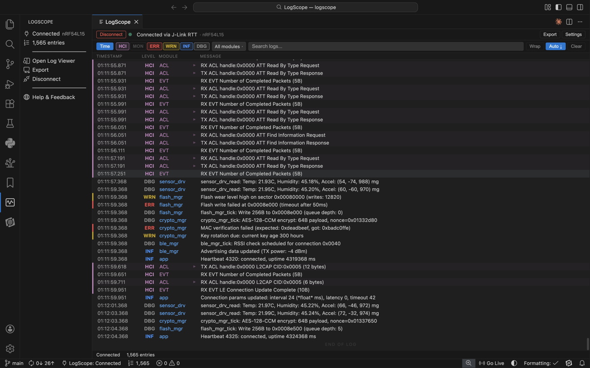

# LogScope

**Real-time embedded log viewer for VS Code with Bluetooth LE HCI decoding.**

LogScope streams logs directly from your embedded device via SEGGER J-Link RTT — no serial cables, no terminal juggling. See your Zephyr RTOS logs in a modern, filterable viewer with deep Bluetooth LE protocol decoding built in.



## Features

- **Zephyr log parsing** — color-coded severity levels, module names, and timestamps parsed automatically
- **Module filtering** — toggle log modules on/off. Focus on Bluetooth LE, hide sensor noise, or vice versa
- **Deep HCI decoding** — 14+ Bluetooth LE HCI packet decoders. See connection parameters, PHY changes, ATT operations — not hex dumps. Click to expand decoded fields
- **ACL/ATT/GATT decoding** — Write Request, Read Response, Notifications, MTU Exchange decoded inline
- **Crash/fault detection** — auto-detects hard faults, bus faults, Zephyr fatal errors, assertions, stack overflows, and watchdog resets. Highlights fault rows and pauses auto-scroll
- **Search** — full-text search across messages, modules, severity levels, and timestamps
- **Wireshark export** — one-click btsnoop export for deep protocol analysis in Wireshark
- **Multi-format export** — export as plain text (.log), JSON Lines (.jsonl), or Wireshark btsnoop (.btsnoop)
- **100K log buffer** — ring buffer holds 100,000 entries for long debug sessions
- **Board reset detection** — automatic detection of device reboots with timestamped markers
- **Zero packet loss** — uses native J-Link RTT via [pylink](https://github.com/square/pylink), not telnet polling
- **Auto-connect** — remembers your last device and reconnects automatically
- **Activity Bar integration** — dedicated sidebar with connection status, entry count, and quick actions

## Supported Devices

LogScope works with **any device connected via a SEGGER J-Link debug probe**:

| Vendor | Devices |
|--------|---------|
| **Nordic Semiconductor** | nRF54L15, nRF54H20, nRF5340, nRF52840, nRF52833, nRF52832, nRF9160, nRF9161 |
| **STMicroelectronics** | STM32F4, STM32L4, STM32H7, STM32WB, STM32U5 |
| **Infineon** | PSoC 6, XMC4500 |
| **Silicon Labs** | EFR32BG22, EFR32MG24 |
| **NXP** | LPC55S69, i.MX RT1060 |
| **Generic** | Any Cortex-M0+, M4, M7, M33 target |

Nordic devices are auto-detected. Other vendors can be selected from the device dropdown.

## Quick Start

### Prerequisites

- **J-Link tools** — install from [segger.com](https://www.segger.com/downloads/jlink/)
- **Python 3** with **pylink-square**:
  ```
  pip install pylink-square
  ```

### Install

Search for **LogScope** in the VS Code Extensions Marketplace, or:

1. Download the latest `.vsix` from [Releases](https://github.com/NovelBits/logscope/releases)
2. In VS Code: `Ctrl+Shift+P` → "Extensions: Install from VSIX..." → select the file

### Connect

1. Click the LogScope icon in the Activity Bar
2. Select your device from the dropdown (or leave as auto-detect for Nordic devices)
3. Click **Connect**
4. Logs start streaming immediately

### Export

Click **Export** in the connection bar to save your session:
- **Text (.log)** — human-readable, grep-friendly
- **JSON Lines (.jsonl)** — structured, one JSON object per line
- **Wireshark (.btsnoop)** — open in Wireshark for deep HCI protocol analysis

## HCI Packet Decoding

LogScope decodes Bluetooth LE HCI packets inline as they appear in the log stream. Click any HCI row to expand and see decoded fields:

- **Connection events** — LE Connection Complete, Disconnect, Connection Update
- **PHY management** — LE Set PHY, LE PHY Update Complete
- **Advertising** — LE Advertising Report with AD structure decoding (device name, flags, UUIDs, TX power)
- **ATT/GATT operations** — Write Request, Read Response, Notifications, MTU Exchange
- **Encryption** — Encryption Change, Long Term Key Request
- **Command Complete** — Read BD ADDR, Read Local Version, Read Buffer Size

Raw hex dump available via toggle on any expanded packet.

## Crash/Fault Detection

LogScope automatically detects common Zephyr RTOS crash patterns:

- ARM Cortex-M hard faults, bus faults, usage faults, memory faults
- Zephyr fatal errors (`ZEPHYR FATAL ERROR`)
- Assertion failures (`ASSERTION FAIL`, `__ASSERT`, `k_panic`)
- Stack overflows
- Watchdog resets

When a fault is detected, the row is highlighted in red and auto-scroll pauses immediately so you don't miss it.

## Settings

| Setting | Default | Description |
|---------|---------|-------------|
| `logscope.jlink.device` | `Cortex-M33` | J-Link target device name |
| `logscope.rtt.pollInterval` | `50` | RTT poll interval in ms |
| `logscope.maxEntries` | `100000` | Maximum log entries in memory |
| `logscope.logWrap` | `false` | Wrap long messages |
| `logscope.autoConnect` | `false` | Auto-connect on open |

Most users won't need to change these — the defaults work well.

## Commands

All actions are available from the Command Palette (`Ctrl+Shift+P`):

| Command | Description |
|---------|-------------|
| `LogScope: Open Log Viewer` | Open the log viewer panel |
| `LogScope: Connect` | Open the panel and connect |
| `LogScope: Disconnect` | Disconnect from device |
| `LogScope: Export` | Export log session |

## How It Works

LogScope uses [pylink](https://github.com/square/pylink) to communicate with SEGGER J-Link probes natively. When you click Connect:

1. A Python helper process starts and opens a persistent J-Link connection
2. RTT is initialized — the J-Link probe handles control block detection automatically
3. Log data streams from the device's RAM buffer to VS Code with zero packet loss
4. The Zephyr log parser extracts timestamps, severity, module names, and messages
5. HCI packets from the Bluetooth LE monitor channel are decoded in real-time
6. Entries appear in the viewer with full filtering, search, and fault detection

RTT reads happen without halting the CPU — your firmware keeps running at full speed.

## Requirements

- VS Code 1.110.0 or later
- SEGGER J-Link tools installed
- Python 3.10+ with `pylink-square` package
- A J-Link debug probe (onboard or standalone)

## FAQ

**Q: Does this work with non-Zephyr firmware?**
A: Yes. Any firmware that outputs text via SEGGER RTT channel 0 will work. The parser expects Zephyr log format but unrecognized lines are still displayed.

**Q: Does it work with non-Bluetooth LE projects?**
A: Yes. LogScope parses any Zephyr RTOS logs. The HCI decoding is a bonus for Bluetooth LE developers, but filtering, search, and export work for all Zephyr projects.

**Q: How is this different from SEGGER RTT Viewer?**
A: RTT Viewer shows you the raw byte stream. LogScope parses it into structured log entries, color-codes by module, decodes Bluetooth LE HCI packets, and lets you filter and search — all inside VS Code.

**Q: Can I use this without a J-Link?**
A: Not currently. LogScope requires a SEGGER J-Link probe for RTT communication. UART/serial support is planned for a future release.

**Q: Can I export logs to Wireshark?**
A: Yes. One-click export to btsnoop format, which Wireshark opens natively for deep HCI protocol analysis.

**Q: My device isn't in the dropdown. What do I do?**
A: Select the matching generic Cortex-M core (M0+, M4, M7, or M33). If you know the exact J-Link device name, you can set it in `logscope.jlink.device` in VS Code settings.

**Q: I'm getting DLL errors on connect.**
A: Make sure no other tool is using the J-Link probe (nRF Connect, Ozone, J-Link Commander). Only one application can hold the J-Link connection at a time.

## License

MIT

## Credits

Built by [Novel Bits](https://novelbits.io) — Bluetooth LE education and tools for embedded developers.
